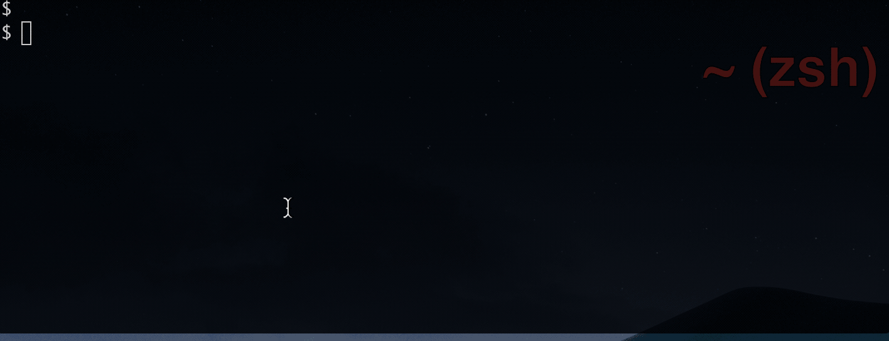
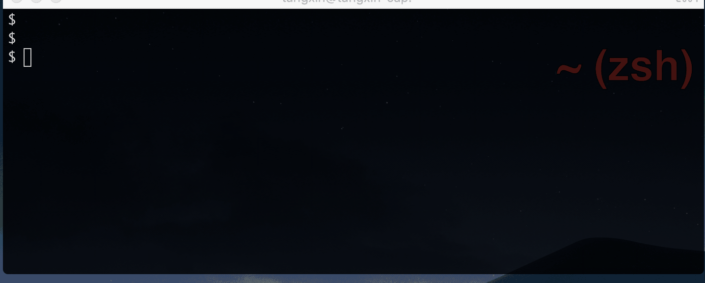

# DNSx

多支持多运营商的 `DNS 命令行` 客户端。


## Usage

```bash
DNSx 配置管理 DNS 解析

Usage:
  dnsx [command]

Available Commands:
  add         添加域名解析
  configure   管理配置文件
  delete      删除解析记录
  help        Help about any command
  search      查询记录信息
  switch      切换域名状态

Flags:
  -c, --config string    config file (default "$HOME/.dnsx/dnsx.json")
  -h, --help             help for dnsx
  -p, --profile string   profile (default "default")

Use "dnsx [command] --help" for more information about a command.
```

+ `dnsx profile configure`


+ `dnsx record add`


+ `dnsx record switch`


+ `dnsx record search`


+ `dnsx record delete`



## Todo List

多后台的 dns 解析配置命令行

+ [x] 使用 `interface` 方法实现多 `backend` 接入
+ [x] 使用 `cobra` 创建子命令
  + [x] `add`
  + [x] `delete`: 交互确认。
  + [ ] `update`
  + [x] `enable`, `disable`
  + [x] `search`
  + [x] `configure`
+ [x] 使用 `cobra` 实现 `config.json` 的配置
  + [x] 增加
  + [x] 更新
  + [x] 优化 `LoadConfig()` 加载位置

+ [ ] 完成 `auto-complete` for zsh: 支持子命令补全， `config.json` 中的域名列表补全

+ 支持多后台
  + [x] `qcloud cns`
  + [x] `aliyun alidns`
  + [ ] `dnspod`

